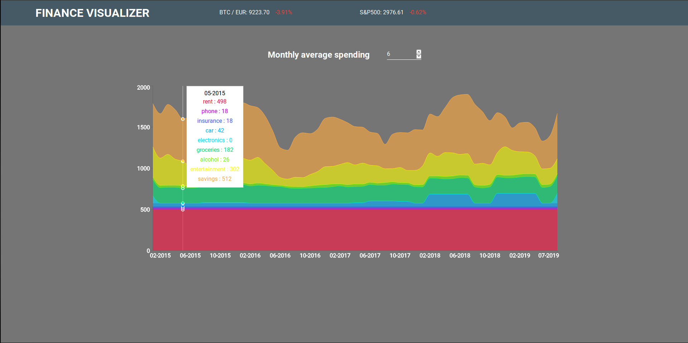

# Finance visualizer

This was my submission to [Junction Online: Impact Hackathon](https://junction.hackerearth.com/) in July 2019. The project is available deployed on [Github pages](https://marcholio.github.io/finance-visualizer/)

A savings app like no other! This application lets you track you budget based on monthly averages, rather than focusing on individual months. Unexpected costs won't ruin you budget anymore!

And wait there's more!

You can even select the average period to be used according to your preferences, how awesome is that!

Product hunt page: https://www.producthunt.com/posts/finance-visualizer

